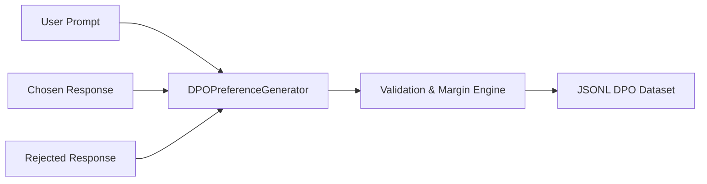

# genpark-dpo-preference-pair-dataset-generator-skill

High-integrity dataset generator and validator for Direct Preference Optimization (DPO) and RLHF alignment workflows.

## Architecture

## Features
- **Strict Quality Constraints**: Validates text uniqueness, non-empty criteria, and score margins.
- **JSONL Serialization**: Formats clean standard DPO dataset lines for direct consumption by Hugging Face TRL or Axolotl.
- **Standard Library Only**: No external dependencies.
